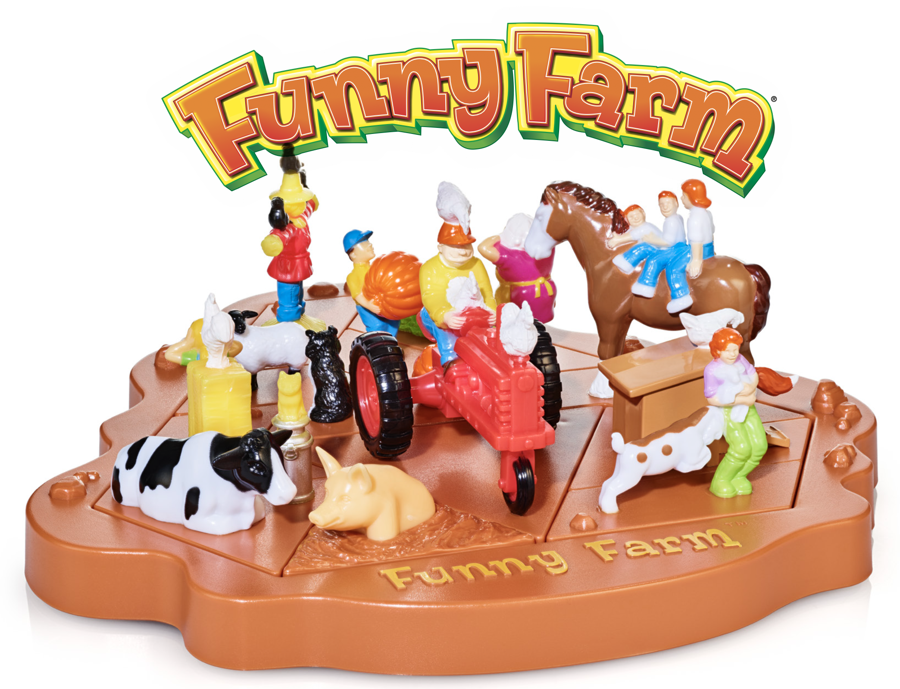
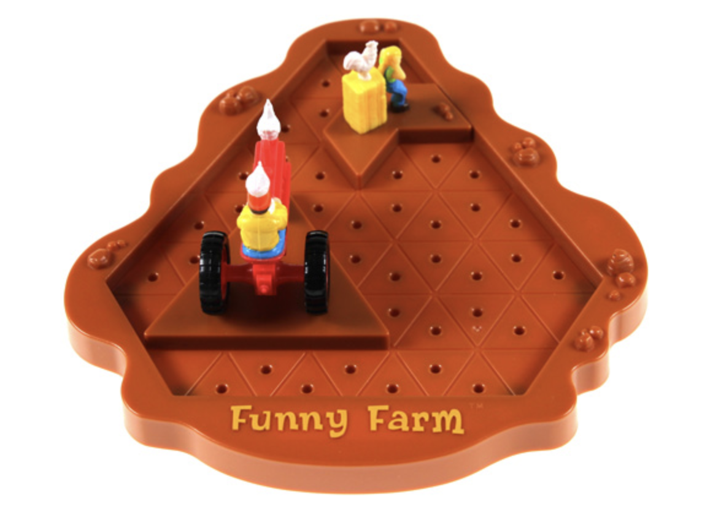
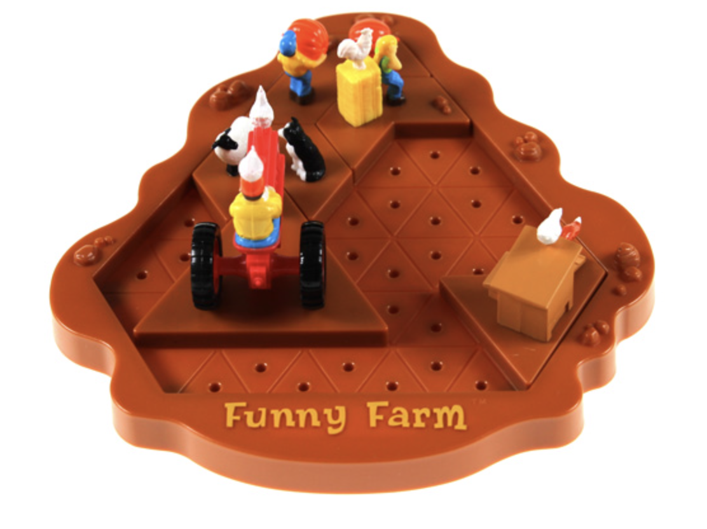
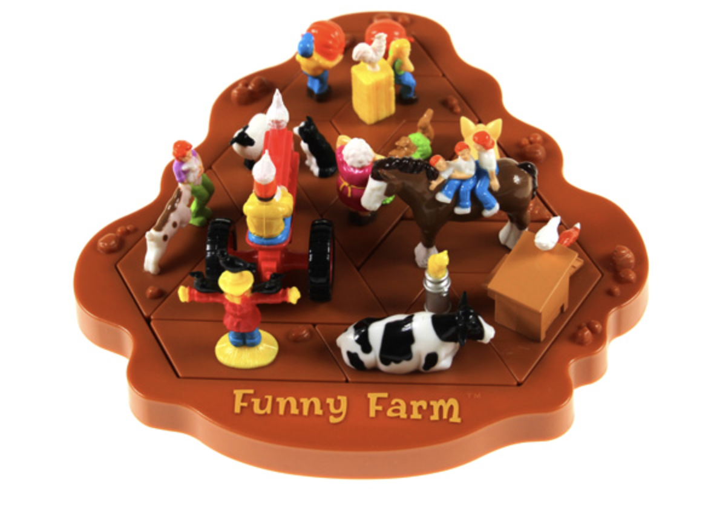
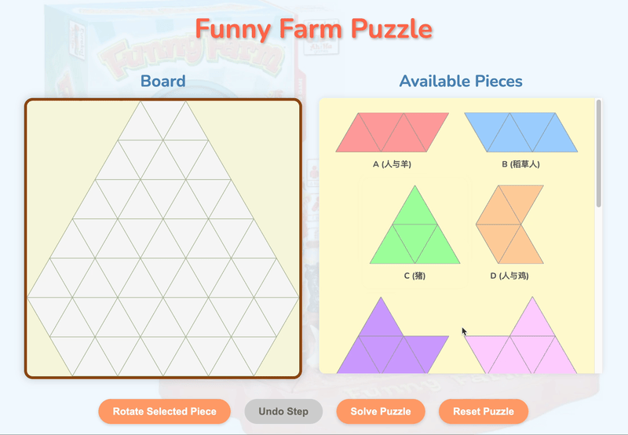

# Funny Farm Puzzle

Welcome to the Funny Farm where life in the barnyard is more fun than work!

This project is a web-based adaptation of the physical "Funny Farm" triangular tiling puzzle game. The goal is to fit all the themed pieces onto the game board.

## How to Play (Physical Version)

The original "Funny Farm" game is challenge-based. Each barnyard challenge shows you where to place the big tractor piece and one or two additional pieces on the barnyard base. Then, you simply fill in the remaining pieces. When each challenge is solved, the barnyard will be full with no empty spaces.

For example, here are the steps for the first challenge:

**Step 1: Initial Setup**

**Step 2: Placing an Additional Piece**

**Step 3: Completed Challenge**

## How to Play (Web Version)

You can play the live version of the game at: [https://funnyfarm.ecs-friday.com/](https://funnyfarm.ecs-friday.com/)

Below is a short demonstration of the web version:

1.  Open the `index.html` file in a web browser.
2.  Drag and drop the available pieces from the right panel onto the board on the left.
3.  Select a piece from the "Available Pieces" list by clicking on it.
4.  Use the "Rotate Selected Piece" button to rotate the currently selected piece.
5.  If you make a mistake, use the "Undo Step" button.
6.  If you get stuck, you can use the "Solve Puzzle" button to see the solution. The solver can also be paused and resumed.
7.  "Reset Puzzle" will clear the board and return all pieces to their initial state.

**Note on Gameplay:** The original physical game includes specific challenges where some pieces are pre-placed. This web version currently focuses on the primary goal of filling the entire empty board.

## Features

*   Interactive drag-and-drop interface for placing pieces.
*   Piece rotation.
*   Undo functionality.
*   Automated puzzle solver with pause/resume capability.
*   Visually distinct pieces and a clear game board.
*   Responsive UI elements and feedback messages.

## Project Structure

*   `index.html`: The main HTML file for the game interface.
*   `style.css`: Contains all the styling for the game.
*   `data.js`: Defines the board shape and the geometric data for each puzzle piece.
*   `board.js`: Handles the rendering and initial interaction logic for the game board and pieces (SVG drawing, drag events).
*   `script.js`: Contains the core game logic, including piece placement validation, solver algorithm, and UI controls.
*   `img/`: Directory for images (e.g., `physical-game.png`, `background.png`, example step images).
*   `favicon.ico`: The icon for the browser tab.

## Notes

*   A significant portion of the code for this project, including this README file itself, was developed with the assistance of AI.
*   Feedback and issue reports are welcome! Please feel free to submit them in the GitHub issue tracker. I plan to explore and test the capabilities of more advanced AI models (such as OpenAI's Codex or future alternatives) for project further development and maintenance tasks once they become available.
*   Will AI be able to fully take over this project and replace human developers in the future? I'm not sure. But it's fun to watch!
